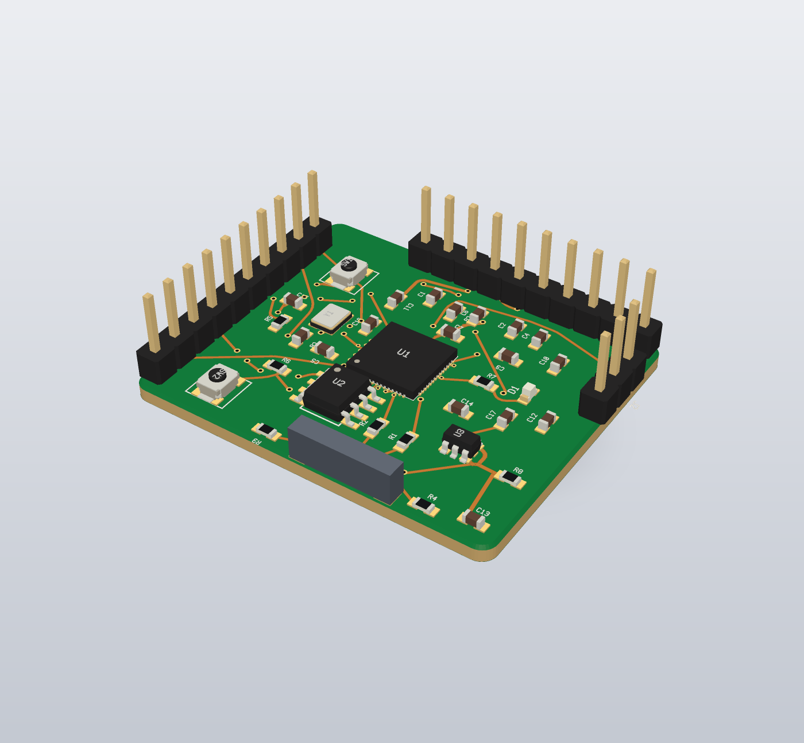

# fragua

[](https://github.com/mentasystems/fragua/actions/workflows/ci.yml)
[](LICENSE)
[](https://fragua.cloud)
[](https://github.com/mentasystems/fragua/releases/latest)

AI-native PCB design tool. The agent does the work, the human watches and steers.

Pure Go: one static binary, local HTTP API, UI in the browser. No Rust, no Tauri, no Node.

```sh
go test ./...
go build -o fragua ./cmd/fragua
./fragua run path/to/board.fragua
# API + UI: http://127.0.0.1:7878  (FRAGUA_API_ADDR, FRAGUA_NO_BROWSER)
```

Cross-compile: `CGO_ENABLED=0 GOOS=linux GOARCH=amd64 go build -o fragua-linux ./cmd/fragua`.

- 🌐 Landing: <https://fragua.cloud>
- 🧭 [VISION.md](VISION.md) — what we are building and why
- 🏗️ [ARCHITECTURE.md](ARCHITECTURE.md) — packages and data flow
- 🤝 [CONTRIBUTING.md](CONTRIBUTING.md) — how to help

## Status

Agent loop: schematic → board → JLCPCB-ready zip.

- `internal/core`: project model (schematic, board, library, pours, rule areas, stackup), nm fixed-point geometry, JSON persistence (`.fragua`; legacy `.json` still loads).
- `internal/script`: line-oriented agent DSL — `lib`, `sym`, `net`, `place`, `auto-place`, `route`, `compact`, `rule-area`, `fab-rules`, `layer`, `escape`, `erc`, `drc`, `si-check`, `pack`, …
- `internal/router`: Theta* any-angle grid, QFN escape-slot matching, RR&R, PathFinder-lite negotiate, organic string-pull, pour stitch. 2- and 4-layer (F / GND / +3V3 / +1V1). JLCPCB mins are the working ceiling.
- `internal/placer`: simulated-annealing legalisation, decoupling-ring seating, edge snap.
- `internal/drc` / `internal/erc`: geometric DRC and schematic ERC.
- `internal/si`: signal-integrity audit (`si-check`) — impedance deviation, return-path plane gaps, diff-pair skew, via budget.
- `internal/fab` + `internal/gerber` + `internal/odb`: JLCPCB / PCBWay / generic pack (Gerber + Excellon + BOM/CPL) and ODB++.
- `internal/render`: board SVG (substrate, copper, silk, pad names, drills) and a static 3D product-shot PNG.
- `internal/host` + `cmd/fragua`: HTTP API + embedded browser UI.

`go test ./...` is green. Stress campaign notes: [`stress/`](stress/).

## Install

One-liner (macOS arm64/x64, Linux x64):

```sh
curl -fsSL https://raw.githubusercontent.com/mentasystems/fragua/master/scripts/install.sh | sh
```

Drops the `fragua` binary in `/usr/local/bin` (or `~/.local/bin` if it
can't write there). Windows users: grab `fragua-<ver>-windows-x64.zip`
from the [releases page](https://github.com/mentasystems/fragua/releases/latest).

Then tell your AI to design the hardware with the `fragua` CLI — it opens
the browser UI, exposes the HTTP script API, and the agent drives the rest.

## Use it from your AI agent

`fragua init` writes the onboarding files (`AGENTS.md`, a Claude Code skill,
a Cursor rule, `.mcp.json`) into your project. It merges rather than
clobbers, so it is safe to re-run.

```sh
cd my-board && fragua init
```

**Claude Code** — `fragua init` then `claude`. The skill and the MCP server
are picked up from the project automatically.

**Cursor** — `fragua init` writes `.cursor/rules/fragua.mdc`; add the MCP
server from `.mcp.json` in Settings → MCP.

**Codex / any MCP client** — point it at the stdio server:

```json
{
  "mcpServers": {
    "fragua": { "command": "fragua", "args": ["mcp"] }
  }
}
```

`fragua mcp` runs the same host as `fragua run`: the agent talks MCP on
stdio while the human watches the live board at
`http://127.0.0.1:7878/ui/`. Tools: `fragua_script`, `fragua_help`,
`fragua_status`, `fragua_state`, `fragua_screenshot`, `fragua_save`,
`fragua_drc`, `fragua_route`.

**No MCP?** The HTTP API needs nothing but `curl` — see
[Drive it from an agent](#drive-it-from-an-agent) below. Machine-readable
docs: [`docs/llms.txt`](docs/llms.txt) and
[`docs/llms-full.txt`](docs/llms-full.txt).

## Run it

The launch subcommands are **`run`** and **`mcp`**. Bare `fragua` (or
`fragua help`) prints the usage + full script reference and exits — so agents
can discover the surface before starting the server. `fragua help <verb>`
prints one verb's usage, aliases and examples.

```sh
go build -o fragua ./cmd/fragua

# Launch empty in-memory project.
./fragua run

# …or open an existing project:
./fragua run /path/to/project.fragua

# Installed binary:
fragua run
fragua run /path/to/project.fragua

# …or the same host plus an MCP server on stdio:
fragua mcp /path/to/project.fragua
```

The browser opens at `http://127.0.0.1:7878/ui/` and the HTTP API listens
on `127.0.0.1:7878` (override: `FRAGUA_API_ADDR`). Set `FRAGUA_NO_BROWSER=1`
to skip the browser.

The UI is where the human watches the agent work and steps in. The board is
live inline SVG — pan, zoom, per-layer visibility, top/bottom view, ratsnest
on the nets still open. Hover or click a pad, trace or via to highlight the
whole net and inspect it; click a part for its key, LCSC id, datasheet and
pins. Drag a part and drop it and the UI runs `move REF X Y` for you (`R`
rotates), showing the exact script line it sent — you and the agent are
editing the same live project. `route`, `auto-place` and `compact` stream a
progress bar you can cancel, DRC/ERC findings are clickable markers on the
canvas, and there is a schematic tab. Everything is served from the binary:
no CDN, no build step, works offline.

## Drive it from an agent

Stateless HTTP — every request is independent. From any tool that can
make HTTP calls (Claude Code, GPT, a shell loop):

```sh
# Discover the full action surface (usage + script reference).
curl -s http://127.0.0.1:7878/
# same: curl -s http://127.0.0.1:7878/help

# Liveness.
curl -s http://127.0.0.1:7878/health

# Run a multi-line script.
curl -s http://127.0.0.1:7878/script \
  -H 'content-type: application/json' \
  -d '{"script": "outline 80 30 radius=2\nstatus"}'

# Live board SVG.
curl -s 'http://127.0.0.1:7878/screenshot?view=board' -o board.svg

# Persist when launched without a file argument.
curl -s http://127.0.0.1:7878/save \
  -H 'content-type: application/json' \
  -d '{"path": "/tmp/board.fragua"}'
```

| Method | Path | Purpose |
|--------|------|---------|
| `GET` | `/`, `/help` | Usage + full script reference (`?verb=route` for one verb) |
| `GET` | `/health` | `ok` |
| `GET` | `/state` | JSON project snapshot |
| `GET` | `/events` | SSE project change stream |
| `GET` | `/ui/` | Browser UI |
| `GET` | `/screenshot` | Board SVG (`?drc=1` bakes in the violation markers) |
| `GET` | `/schematic` | Schematic SVG |
| `GET` | `/summary` | Status line as JSON: outline, layers, parts, nets routed, op in flight |
| `GET` | `/drc`, `/erc` | Violations as JSON, each with a stable id and a location |
| `GET` | `/part?key=K` | Library entry behind a footprint key (description, datasheet, LCSC) |
| `POST` | `/script` | Multi-line script body `{"script":"..."}` |
| `POST` | `/save` | Atomic write + bind autosave `{"path":"..."}` |
| `POST` | `/cancel` | Stop the long op in flight; it keeps the work already committed |

Replies are `text/plain`: per-line outcomes in the form
`[L<n> ok|FAIL <tool>] <text>`, plus a warning when the session is
memory-only.

## Real parts

Three ways to get a footprint *and* its schematic symbol in one line — no
hand-typed pads. Each one caches into `~/.pcb-library`, so the second call is
instant and works offline.

```text
part C2040                       # LCSC/JLCPCB via the EasyEDA API → U1, 57 pads,
                                 # named pins (GPIO7, GND…), MPN + datasheet
part LCSC:C25804 as=R1 value=10k
part kicad:Package_TO_SOT_SMD:SOT-23 as=Q1   # offline, from a KiCad install
lib-gen R0603 family=chip size=0603 as=R2    # IPC-7351B land pattern, no library
lib-gen U2_QFN family=qfn pins=32 pitch=0.5 body=5 ep=3.2 as=U2
lib-import kicad ~/my.pretty                 # bulk-import .kicad_mod files
list-parts                                   # key, source, pins, LCSC/MPN/datasheet
```

After any of those the reference is ready to use: `place U1 15 15`,
`net GND U1.GND C1.2`, `auto-place`, `route`. `as=` names the reference,
`key=` the library entry. `FRAGUA_OFFLINE=1` makes `part LCSC:…` cache-only;
`FRAGUA_KICAD_LIBS` adds KiCad library roots beyond the stock install paths.
`lib-gen` covers chip (0201…2512), sot23/-5/-6, sot223, sot89, soic, tssop,
ssop, msop, qfn, dfn, wlp, qfp, lqfp, dip and pin headers, at `density=N|L|M`.

## End-to-end recipe

```text
class ground pour=both
class power width=0.4

sym U1 ic key=esp32_s3_zero
  pin 1 L 3V3 role=power_in
  pin 2 L GND role=power_in
  ...
sym C1 capacitor key=c_0603 lcsc=C14663
sym R1 resistor key=r_0603 lcsc=C25804

net GND  U1.GND C1.2 R1.2 class=ground
net +3V3 U1.3V3 C1.1 class=power

erc

palette U1 esp32_s3_zero
palette C1 c_0603 value=100nF
palette R1 r_0603 value=10k
place U1 25 15
place C1 35 15
place R1 35 25

auto-place R1 C1 seed=42
route
# optional once clean: compact allow_failed=0 route_seconds=90
pack fab=jlcpcb out=/tmp
```

The final line writes `/tmp/<project>-jlcpcb.zip` ready to upload.
Recommended pipeline: ERC → power planes / classes → place → auto-place →
route → (compact) → pack.

## Open it in KiCad

The zip carries the board as a KiCad 9 file next to the gerbers, and you can
write one on its own:

```text
pack fab=kicad out=/tmp/board.kicad_pcb
```

Footprints, pads and nets, tracks, vias, Edge.Cuts, silkscreen, courtyards,
keepouts and the 4-layer stackup all come across, and pours ship pre-filled so
the copper shows without a refill.

## 3D product shot

`fragua render` writes an angled PNG of a board — thickness, soldermask,
copper, silkscreen, drills, and component bodies — for a blog, a handoff, or
an agent checking its own work. The live UI stays the 2D SVG. Bodies are
KiCad WRL models downloaded into a local cache on demand (CC-BY-SA, not
vendored); a missing model is a box, and the render still finishes.

```bash
fragua render --3d stress/rp2040-minimal.fragua -o board.png --width 1600
fragua render --3d board.fragua -o boxes.png --models=none
```

`fragua render3d` is the same command. `-o` defaults to `<name>-3d.png`.
See [docs/render-3d.md](docs/render-3d.md).



## Benchmark

`fragua bench` runs the reference boards in `bench/boards/` through the same
auto-place → route → drc loop an agent runs and prints one row per board.
Measured numbers from this machine are in [BENCH.md](BENCH.md).

```bash
fragua bench bench/boards --seed 42 --budget 60 --md bench.md --json bench.json
```
